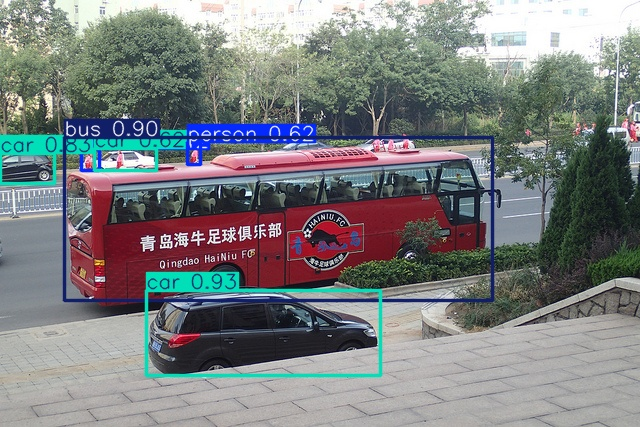

# Implementation of YOLO26

This repository is a from-scratch PyTorch implementation of YOLO26, written using the official
[Ultralytics YOLO26](https://docs.ultralytics.com/models/yolo26) implementation as a reference.

This implementation is mirroring YOLO26 in the size "n" (nano).

## Goal

The goal of this project is to detect street objects in images. The model is
trained from scratch on a subset of COCO containing street scenes, and it learns to find
classes that make up such a scene: persons, bicycles, motorcycles, cars, buses and
trucks.



*Prediction of `pre_trained/my_yolo26_n.pt` on a validation image, boxes at confidence >= 0.35.*

## Requirements

To install the requirements:

```setup
pip install -r requirements.txt
```

## Dataset

To get the training data, open the ``notebooks/download_dataset.ipynb`` notebook. It downloads the
street-object images and boxes straight from the COCO servers and writes them as a YOLO dataset under
``datasets/`` (~70k train and ~3k val images, about 11 GB).

> Before starting adjust ``MAX_SAMPLES`` to cap the images per split, e.g. ``2000`` for a quick test.
> The download is resumable, so a canceled run continues where it stopped.

## Training

To train the model, open the ``notebooks/training.ipynb`` notebook and use it to start the training.

> Before starting adjust ``RUN_NAME``, ``EPOCHS`` and ``WORKERS`` variables according to your goal and device. 

## Usage
To use the model you can either train one yourself or use the ``pre_trained/my_yolo26_n.pt``.
For a smooth user experience the model is wrapped by a ultralytics adapter, enabling tasks like
object detection and classification in images ``notebooks/inference.ipynb`` or live tracking in videos ``notebooks/live_tracking.ipynb``.
However especially the latter one needs more than just the model itself, which would exceed the scope
of this project, so that the functionality itself is provided by the ultralytics library.

## Results

The ``pre_trained/my_yolo26_n.pt`` is the model that we trained over 100 epochs using a COCO subset
as explained in [Dataset](#dataset). In the following it is evaluated using mAP and compared
to the offical pre-trained model from Ultralytics.

| Model name    | Params     | GFLOPs | mAP50 | mAP50-95 |
|---------------|-----------:|-------:|------:|---------:|
| **MyYolo26n** |  2,506,140 |    5.8 | 0.573 |    0.387 |
| Yolo26n       |  2,506,140 |    5.8 | 0.601 |    0.408 |

Per-class mAP50-95:

| Model name    |    person | bicycle | motorcycle |       car |   bus | truck |
|---------------|----------:|--------:|-----------:|----------:|------:|------:|
| **MyYolo26n** | **0.460** |   0.225 |      0.371 | **0.356** | 0.578 | 0.333 |
| Yolo26n       |     0.445 |   0.264 |      0.409 |     0.351 | 0.616 | 0.360 |


Even though our model was trained for only 100 epochs, compared to the
[245 epochs](https://docs.ultralytics.com/guides/yolo26-training-recipe#optimizer-and-learning-rate)
of the official YOLO26n, the results are only slightly behind. On the classes `car` and `person`
it even comes out ahead of the official model. The likely reason is that we trained on a subset of
COCO only, which left us with a comparatively larger share of training images for exactly those
two classes. Overall these numbers show that our implementation works, since it lands in the same
accuracy range as the official YOLO26n at an identical parameter count.

## Scope

To keep the project focused we wrote the parts that define the model itself and reused the
surrounding infrastructure instead of rebuilding it. Everything under ``src/`` is our implementation of the reference,
which covers the network blocks of backbone and neck, the detection head with its anchor
generation and box decoding, the end-to-end loss with its one-to-many and one-to-one branches and
the task-aligned assigner that matches predictions to ground truth. What we did not write is the
utility around the model, so the training loop, the data loading and augmentation pipeline,
postprocessing, the validation metrics and the tracker all come from Ultralytics and are attached
to our model through a small adapter in ``src/ultralytics_adapter.py``. 

Live tracking is one clear case of that decision. It is the next step for a detector
like this, for example on surveillance cameras.
However building it properly is a problem of its own and well beyond the scope here, which is why
we rely on the tracker that Ultralytics already provides.

## License

This project is licensed under the MIT License – see the [LICENSE](./LICENSE) file for details.